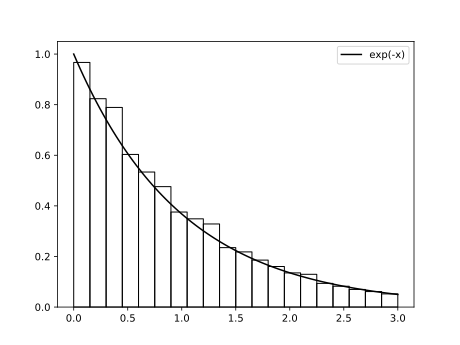

<h1>von Neumann exponential distribution algorithm</h1>

<h1>References</h1>
Von Neumann J. (1951) Various techniques used in connection with
random digits. Journal of Research of the National Bureau of
Standards, 3: 36-38.
